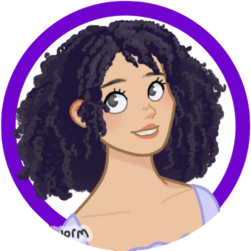

<h1 align="center">Hello, World! I'm Amanda Amorim ʚĭɞ   (programming beginner) </h1>

 
  

 ##

  

  <h3>Learning 🌱: </h3>
  
  
  
  
   
  
  
  

  
##
 

<!--CONTATOS -->
   
  
  
  
  
 
  

  
